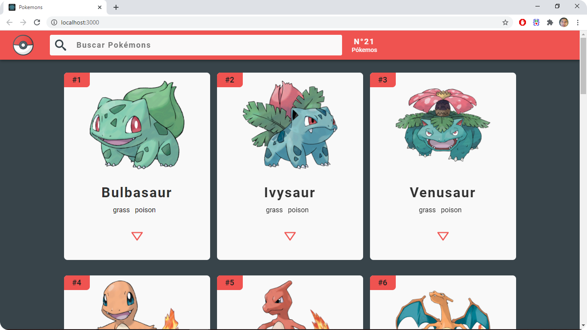
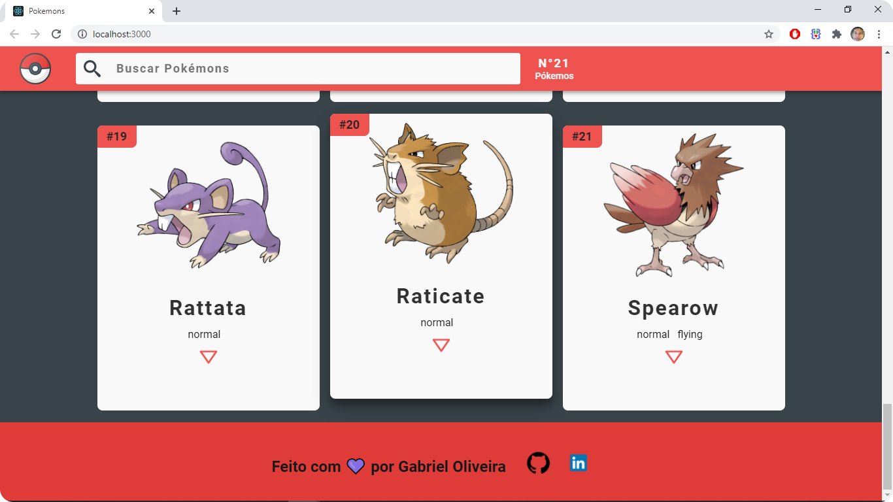
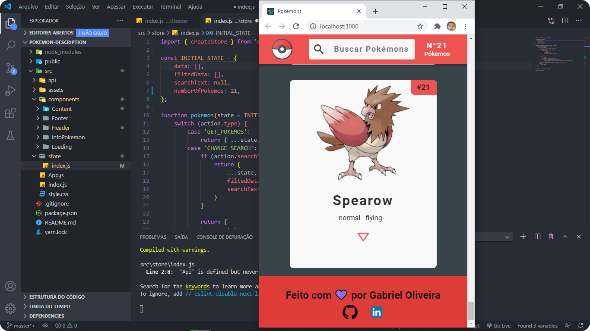
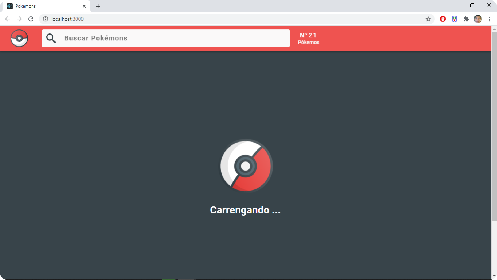

<h1 align="center">
   
  
   
  ✔✔Pokedex React Application 
   
</h1>

<h3 align="left">Simple application using React together with <a href="https://pokeapi.co/" target="_blank">PokeApi</a>👍👍🎁</h3>

<table>
  <theade>
    <th>01</th>
    <th>02</th>
    <th>03</th>
    <th>04</th>
  </theade>
  <tbody>
    <td></td>
    <td></td>
    <td></td>
    <td></td>
   </tbody>
</table>

## How use
To run this project you need to have installed [Git](https://git-scm.com) and [React - Create React App](https://github.com/facebook/create-react-app) on your computer.

Having requirements installed you can run the command `$ git clone https://github.com/gabriel-oliveira800/pokedex-examplo-react`
to clone this repository on your machine. Enter the project folders and run the application.

In the project directory, you can run:
### `$ cd myproject`

### `$ yarn start`
Runs the app in the development mode.\
Open [http://localhost:3000](http://localhost:3000) to view it in the browser.

### `$ yarn build`

Builds the app for production to the `build` folder.\
It correctly bundles React in production mode and optimizes the build for the best performance.

The build is minified and the filenames include the hashes.\
Your app is ready to be deployed!

See the section about [deployment](https://facebook.github.io/create-react-app/docs/deployment) for more information.
